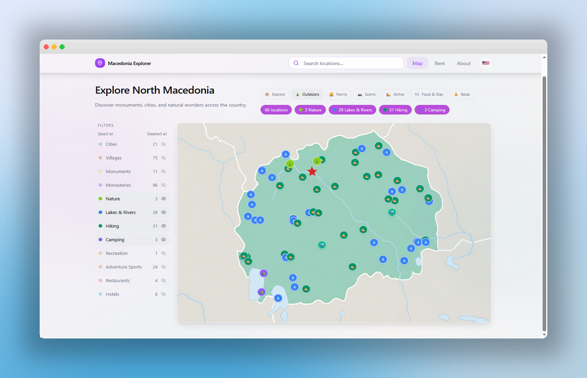

# Macedonia Explorer

Interactive map application for exploring North Macedonia — browse monuments, cities, nature spots, camping locations, and more.



## Features

- **Interactive map** with 262+ curated locations on a custom map
- **Multi-language** — English / Macedonian toggle with translated UI, filters, and location names
- **Category filters** — Monuments, Cities, Nature, Camping, Recreation, Restaurants, Hotels, Lakes & Rivers
- **Auto-detection** — new location types from data appear automatically in the legend
- **Location details** — hover any pin for name, description, coordinates, and Google Maps navigation
- **Responsive** — desktop sidebar filters, mobile-optimized chip filters
- **Modern UI** — frosted-glass navigation, cool-toned palette with teal accents, clean typography

## Tech Stack

- React 18 + TypeScript
- Vite
- Tailwind CSS + shadcn/ui
- React Router
- Redux Toolkit + RTK Query
- React Testing Library + Jest
- Custom i18n (context-based, zero dependencies)

## Getting Started

```bash
# Install dependencies
npm install

# Start development server
npm run dev

# Run tests
npm test

# Run tests with coverage
npm run test:coverage

# Watch tests during development
npm run test:watch
```

## Project Structure

```
src/
├── store/
│   ├── index.ts               # Redux store configuration
│   ├── api/
│   │   └── locationsApi.ts    # RTK Query API for location data
│   └── slices/
│       ├── filtersSlice.ts     # Filter state management
│       └── uiSlice.ts         # UI state (selected/hovered locations)
├── i18n/
│   ├── translations.ts         # EN + MK translation strings
│   └── LanguageContext.tsx    # React context provider + useLanguage hook
├── components/
│   ├── map/
│   │   ├── MapHeader.tsx      # Page title, stats, and badge pills
│   │   ├── MapFilters.tsx     # Desktop sidebar + mobile chip filters
│   │   └── MapPins.tsx      # Pin rendering and coordinate mapping
│   ├── CustomMapRedux.tsx     # Redux-powered main map orchestrator
│   ├── CustomMap.tsx          # Legacy component (deprecated)
│   ├── LocationTooltip.tsx    # Hover tooltip with navigation
│   └── Navigation.tsx         # Top nav bar with language toggle
├── hooks/
│   ├── index.ts              # Hook exports
│   ├── useAppDispatch.ts     # Typed Redux dispatch hook
│   ├── useAppSelector.ts     # Typed Redux selector hook
│   └── useMapInteractions.ts # Tooltip state and navigation logic
├── components/__tests__/
│   └── CustomMapRedux.test.tsx # Component tests
├── types/
│   └── location.ts           # Shared Location interface (name + nameMk)
├── constants/
│   └── locationTypes.ts      # Category config (color, icon, label)
├── data/
│   └── locations.json       # Location data (262+ entries)
├── pages/
│   ├── Index.tsx
│   ├── About.tsx
│   └── Rent.tsx
├── setupTests.ts            # Jest configuration and mocks
└── index.css               # Design tokens
```

## Adding Locations

Add entries to `src/data/locations.json`:

```json
{
  "name": "Location Name",
  "nameMk": "Име на Локација",
  "lat": 41.9981,
  "lng": 21.4254,
  "type": "monument",
  "description": "Brief description"
}
```

Register new types in `src/constants/locationTypes.ts` — they appear in the UI automatically.

## Multi-Language (i18n)

The app uses a lightweight context-based i18n system with zero external dependencies.

### How It Works

1. **LanguageContext** (`src/i18n/LanguageContext.tsx`) wraps the app and provides:
   - `language` — current language (`'en'` or `'mk'`)
   - `t` — translation object for the active language
   - `toggleLanguage()` — switches between EN ↔ MK and persists to `localStorage`

2. **Translation strings** live in `src/i18n/translations.ts` — a single file with `en` and `mk` objects sharing the same key structure.

3. **Flag toggle** (🇬🇧 / 🇲🇰) in the navbar shows the current language and switches on click.

### Using Translations in Components

```tsx
import { useLanguage } from '@/i18n/LanguageContext';

const MyComponent = () => {
  const { t, language } = useLanguage();
  return <h1>{t.map.title}</h1>;
};
```

### Adding New UI Translations

1. Open `src/i18n/translations.ts`
2. Add your key to both `en` and `mk` objects:

```ts
en: {
  mySection: {
    greeting: 'Welcome',
  }
},
mk: {
  mySection: {
    greeting: 'Добредојдовте',
  }
}
```

3. Use in component: `t.mySection.greeting`

### Translating Location Pin Names

Each location in `src/data/locations.json` supports optional `nameMk` and `descriptionMk` fields for Macedonian translations:

```json
{
  "id": "ohrid",
  "name": "Ohrid",
  "nameMk": "Охрид",
  "description": "A lakeside city with UNESCO heritage...",
  "descriptionMk": "Град покрај езеро со UNESCO наследство...",
  "type": "city",
  "latitude": 41.1231,
  "longitude": 20.8016,
  "coordinates": [20.8016, 41.1231]
}
```

**Rules:**
- `name` (required) — always the English name, used as default
- `nameMk` (optional) — Macedonian name shown in tooltips when language is MK
- `description` (required) — English description shown in tooltips
- `descriptionMk` (optional) — Macedonian description shown in tooltips when language is MK
- If `nameMk` or `descriptionMk` is missing, the English version is shown in both languages

### Adding a New Language

1. Add the locale code to the `Language` type in `translations.ts`: `type Language = 'en' | 'mk' | 'sq';`
2. Add a full translation object matching the `en` structure
3. Update `toggleLanguage()` in `LanguageContext.tsx` to cycle through languages
4. Add the corresponding flag emoji to the navbar toggle
5. Optionally add `nameSq` (or similar) to `Location` interface and `locations.json`

## Design

- **Palette:** Cool blue-gray background with teal accent (`hsl(172, 50%, 40%)`)
- **Navigation:** Frosted glass with subtle gradient tint
- **Components:** Glass panels, badge pills, section cards
- **Tokens:** All colors defined as HSL CSS variables in `index.css`

## Testing

The project includes a comprehensive testing setup with Jest and React Testing Library:

### Test Structure
- **Unit tests** for components in `src/components/__tests__/`
- **Integration tests** for Redux slices and API endpoints
- **Mock configurations** in `src/setupTests.ts`

### Running Tests
```bash
# Run all tests once
npm test

# Run tests in watch mode
npm run test:watch

# Generate coverage report
npm run test:coverage
```

### Test Coverage Goals
- **Target**: 90%+ code coverage
- **Components**: Test user interactions and state changes
- **Redux**: Test reducers, selectors, and async thunks
- **API**: Test data fetching and error handling

## Redux Architecture

The application uses Redux Toolkit for state management with the following structure:

### Store Slices
- **filtersSlice**: Manages location type filters and search queries
- **uiSlice**: Handles UI state (selected locations, tooltips, modals)
- **locationsApi**: RTK Query for location data fetching and caching

### Benefits
- **Type safety**: Full TypeScript integration
- **Performance**: Automatic caching and memoization
- **DevTools**: Redux DevTools integration
- **Scalability**: Easy to add new features and state

## Performance Optimizations

### Phase 1 Improvements
- **Redux Toolkit**: Optimized state updates with Immer
- **RTK Query**: Intelligent caching and background updates
- **Code splitting**: Lazy loading of components
- **Type safety**: Reduced runtime errors with strict TypeScript

## Future Roadmap

### Phase 2: Performance & Data Optimization
- Virtual scrolling for large location lists
- Map clustering for zoom levels
- IndexedDB for offline storage
- Web Workers for heavy computations

### Phase 3: Advanced Features
- PWA capabilities
- Real-time updates
- Advanced analytics
- A/B testing framework

## License

All rights reserved.
